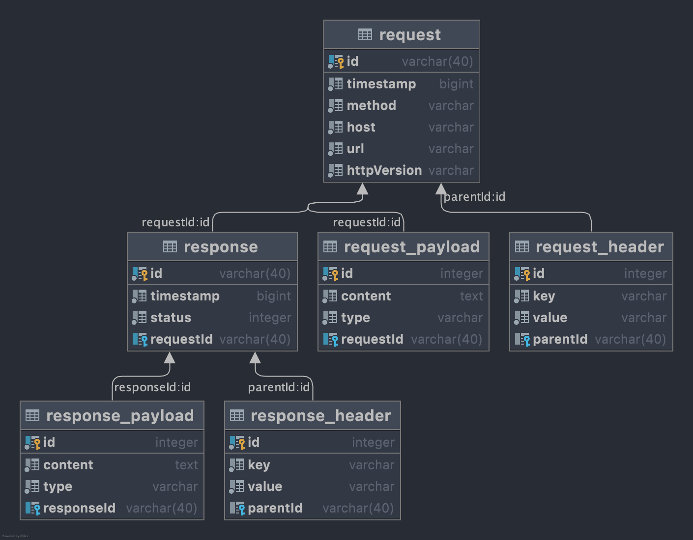

# Documentation: Database
###### V0.0.1-A

### Schema Documentation

###### Table ``request``
```sql
create table request
(
    id            varchar(40) not null
        constraint "PK_167d324701e6867f189aed52e18"
            primary key,
    timestamp     bigint      not null,
    method        varchar     not null,
    host          varchar     not null,
    url           varchar     not null,
    "httpVersion" varchar     not null
);
```

###### Table ``request_payload``

```sql
create table request_payload
(
    id          serial
        constraint "PK_ae5eec51eec6000fb63e96c7fdc"
            primary key,
    content     text    not null,
    type        varchar not null,
    "requestId" varchar(40)
        constraint "REL_1441ebc9815a9f1991b1f6d102"
            unique
        constraint "FK_1441ebc9815a9f1991b1f6d1022"
            references request
);
```

###### Table ``request_header``

```sql
create table request_header
(
    id         serial
        constraint "PK_77bfd50f691bf8234baa1043357"
            primary key,
    key        varchar not null,
    value      varchar not null,
    "parentId" varchar(40)
        constraint "FK_09808be7830c11cf80727302cd2"
            references request
);
```

###### Table ``response``

```sql
create table response
(
    id          varchar(40) not null
        constraint "PK_f64544baf2b4dc48ba623ce768f"
            primary key,
    timestamp   bigint      not null,
    status      integer     not null,
    "requestId" varchar(40)
        constraint "REL_d8eecba590e554b8a3fdaa884f"
            unique
        constraint "FK_d8eecba590e554b8a3fdaa884f0"
            references request
);
```

###### Table ``response_payload``

```sql
create table response_payload
(
    id           serial
        constraint "PK_e1ef81e5b54fdeccac5d901fd68"
            primary key,
    content      text    not null,
    type         varchar not null,
    "responseId" varchar(40)
        constraint "REL_327611e8d1f9c2d46e4e79dfb4"
            unique
        constraint "FK_327611e8d1f9c2d46e4e79dfb47"
            references response
);
```

###### Table ``response_header``

```sql
create table response_header
(
    id         serial
        constraint "PK_1f699b9c621603c6a8d1f2e8c96"
            primary key,
    key        varchar not null,
    value      varchar not null,
    "parentId" varchar(40)
        constraint "FK_8b2a736041856e7e3a6b5ab9bb5"
            references response
);
```

---

### Diagram



---